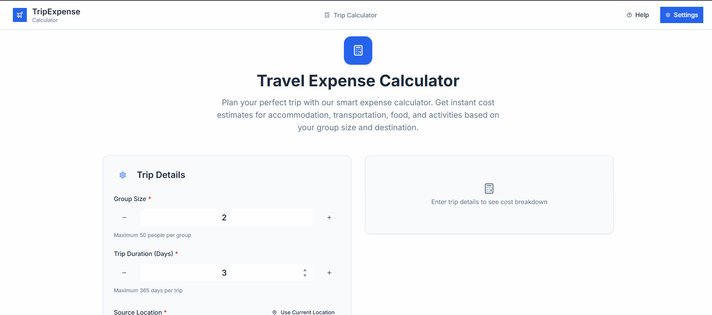
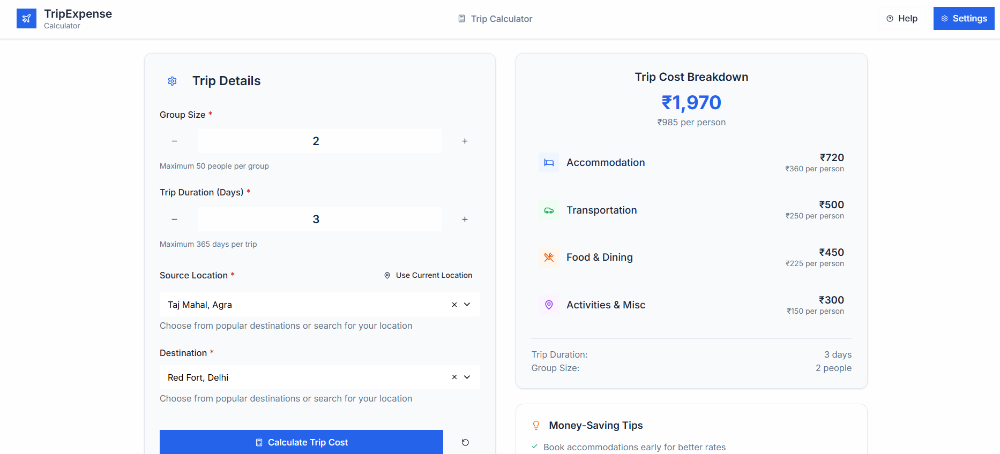

🌍 Trip Calci

Trip Calci is a simple web app that helps users calculate total trip expenses based on the number of members, number of days, source, and destination. It provides a quick estimate of accommodation and travel costs for trip planning.

✨ Features

👫 Enter number of members going on the trip

📅 Enter number of days for the trip

🏠 Calculates accommodation expenses

🚌 Calculates travel expenses (based on source & destination)

📊 Shows total cost of the trip in a clean summary

🛠️ Tech Stack

Frontend: React + Vite

Styling: Tailwind CSS (if you used it) / CSS3

Deployment: Netlify / Vercel (optional)

🚀 Getting Started
1️⃣ Clone the repository
git clone (https://github.com/Khushii2567/TripCalci.git)
cd tripCalci

2️⃣ Install dependencies
npm install

3️⃣ Run the project locally
npm run dev


Now open http://localhost:5173
 in your browser.

4️⃣ Build for production
npm run build

## 📷 Screenshots

### Home Page  


### Trip Calculation Result  


🌐 Live Demo

👉 Click here to try it out
 (if deployed)
## 📁 Project Structure

```
react_app/
├── public/             # Static assets
├── src/
│   ├── components/     # Reusable UI components
│   ├── pages/          # Page components
│   ├── styles/         # Global styles and Tailwind configuration
│   ├── App.jsx         # Main application component
│   ├── Routes.jsx      # Application routes
│   └── index.jsx       # Application entry point
├── .env                # Environment variables
├── index.html          # HTML template
├── package.json        # Project dependencies and scripts
├── tailwind.config.js  # Tailwind CSS configuration
└── vite.config.js      # Vite configuration
``` 

📈 Future Enhancements

🍽️ Add food expenses calculation

🌦️ Integrate weather API for trip planning

🌍 Currency conversion for international trips

📱 Make fully responsive for mobile

👨‍💻 Author

Khushii2567 – github.com/Khushii2567


⚡ Made with React + Vite to simplify trip planning
